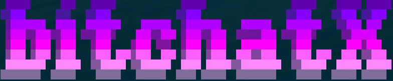

An IRC-style Nostr client for ephemeral geohash channels, inspired by BitchX and Bitchat.

## Features

- **Ephemeral Identity**: Generate new cryptographic identity each session or use your nsec key
- **Geohash Channels**: Join location-based channels using geohash identifiers  
- **IRC Commands**: Familiar `/join`, `/msg`, `/nick`, `/quit` interface
- **BitchX-style UI**: Terminal-based interface inspired by classic IRC clients
- **Nostr Protocol**: Uses ephemeral events (kind 20000) for messaging
- **Cross-platform**: Native builds for Linux, Windows, macOS

## Installation

```bash
# Clone the repository (replace with actual repo URL)
git clone <repo-url>
cd bitchatx

# Build from source (single platform)
cargo build --release

# Or use the build script for cross-platform builds
chmod +x build.sh
./build.sh

# Run the application
./target/release/bitchatx
```

### Dependencies
- Rust 1.70+ 
- `cargo` build system
- Terminal with 256-color support for best experience

## Usage

### Basic Usage
```bash
# Start with ephemeral identity (no channels joined by default)
./bitchatx

# Start with your Nostr key
./bitchatx --nsec nsec1...

# Auto-join a geohash channel on startup
./bitchatx --channel dr5reg
```

### IRC Commands
- `/join <geohash>` - Join a geohash channel (e.g., `/join dr5reg`)  
- `/leave` - Leave current channel
- `/msg <channel> <message>` - Send message to specific channel
- `/nick <nickname>` - Change your display name (session only)
- `/list` - List active channels
- `/help`, `/commands` - Show help
- `/quit`, `/exit` - Exit BitchatX

### Key Bindings
- `i` - Enter input mode
- `Esc` - Exit input mode to normal mode
- `q` - Quit application (in normal mode)
- `Up/Down` - Scroll through messages
- `Page Up/Down` - Fast scroll

## Identity System

BitchatX supports two identity modes:

### Ephemeral Identity (Default)
- **New identity each session**: Fresh cryptographic keypair generated on startup
- **Maximum privacy**: No persistent identity across sessions  
- **Random nicknames**: Auto-assigned names like `cyberdaemon1337`, `shadowbyte2048`
- **Truly ephemeral**: Identity discarded when session ends

### Persistent Identity (nsec)
- **Your Nostr key**: Use your existing Nostr private key
- **Cross-session consistency**: Same identity every time
- **Cryptographic authenticity**: Messages provably from your key

```bash
# Ephemeral mode (default)
./bitchatx

# Persistent mode with your nsec
./bitchatx --nsec nsec1your_private_key_here
```

**Note**: The `/nick` command only changes your display name locally within the current session and does not update your Nostr profile.

## Building

### Download Pre-built Binaries
Download the latest release for your platform from the [Releases page](../../releases).

### Build from Source
```bash
# Quick build for current platform
cargo build --release

# Or use the build script (includes Windows cross-compilation)
chmod +x build.sh
./build.sh
```

For detailed build instructions including cross-platform builds, see [BUILD.md](BUILD.md).

## Architecture

BitchatX is built with:
- **Rust** - Memory-safe systems programming
- **Ratatui** - Terminal user interface framework
- **Nostr-SDK** - Nostr protocol implementation
- **Crossterm** - Cross-platform terminal manipulation

The application follows the ephemeral messaging pattern from the Bitchat project, using Nostr event kind 20000 with geohash-based channel tagging.

## Contributing

BitchatX is inspired by the classic BitchX IRC client and the modern Bitchat application. Contributions welcome!

## License

MIT